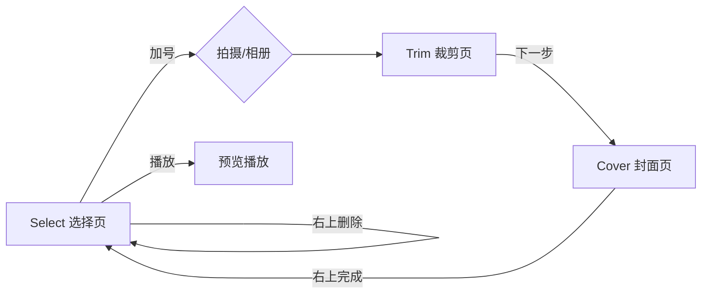

# Video Edit Demo Module

## Report

## [S1] Problem

KtMain 实验室缺少「视频剪辑」类交互用例。需要一个可从首页进入的独立模块，完整演示：

**加号 → 拍摄/相册 → 裁剪区间 →（滤镜预留，本期不实现）→ 帧条滑选封面 → 完成回选择页（封面 + 播放按钮；右上删除）**

播放器必须基于 **Media3 Player**，且做好封装以便后续替换；滤镜本期不做，但要为接入预留扩展点。代码不放在 `app` 模块，单独新建 `videoedit` 模块。

## [S2] Design

### 决策（已定）

| 决策点 | 选择 |
| --- | --- |
| 模块形态 | 独立 Android Library 模块 `:videoedit`，`app` 仅依赖并挂入口 |
| 裁剪/滤镜是否写入成片 | 否，仅预览模拟（记录区间参数） |
| 页面载体 | 单 Activity + Fragment 回退栈 |
| 播放器 | Media3，经 `VideoPlayer` 接口封装，默认 `Media3VideoPlayer` |
| 滤镜 | 本期不实现 UI/算法；保留 `PreviewFilter` 扩展点与草稿字段 |
| 入口 | HomeActivity 模块卡片跳转 `VideoEditActivity` |

### 工程结构

```
videoedit/                          # Android Library，namespace com.cy.ktmain.videoedit
  src/main/java/com/cy/ktmain/videoedit/
    VideoEditActivity.kt            # 宿主：Fragment 栈、ActivityResult、VideoDraft 状态
    model/VideoDraft.kt             # 跨页共享状态
    model/PreviewFilter.kt          # 滤镜扩展点（接口 + 空实现）
    player/VideoPlayer.kt           # 可替换播放器接口
    player/Media3VideoPlayer.kt     # Media3 默认实现
    player/VideoPlayerFactory.kt    # 创建入口，后续可换实现
    media/VideoSourceRepository.kt  # 相册/拍摄结果落地私有副本
    media/FrameExtractor.kt         # 异步抽帧（封面条）
    select/SelectVideoFragment.kt
    trim/TrimVideoFragment.kt
    cover/CoverPublishFragment.kt
    widget/RangeSeekBar.kt          # 双端裁剪滑杆
    widget/FrameStripView.kt        # 横向帧条（中线选封面）
  src/main/res/...
app/
  HomeActivity + strings            # 仅增加模块卡片入口
  build.gradle.kts                  # implementation(project(":videoedit"))
```

### 播放器契约（可替换）

```kotlin
interface VideoPlayer {
    fun prepare(uri: Uri)
    fun play()
    fun pause()
    fun seekTo(positionMs: Long)
    fun setSurface(surface: Surface?)
    fun currentPositionMs(): Long
    fun durationMs(): Long
    fun isPlaying(): Boolean
    fun setListener(listener: Listener?)
    fun release()

    interface Listener {
        fun onPrepared(durationMs: Long)
        fun onCompleted()
        fun onError(message: String)
    }
}
```

- 所有页面只依赖 `VideoPlayer` / `VideoPlayerFactory.create(context)`，不直接引用 Media3 类型。
- `Media3VideoPlayer` 内部使用 `androidx.media3.exoplayer.ExoPlayer`（`Player` 亦可由 Factory 注入）。
- 滤镜扩展：`PreviewFilter.applyTo(view)` 或后续挂在 `VideoPlayer` 渲染层；草稿含 `filterId: String`，默认 `"NONE"`。

### 数据模型

```kotlin
data class VideoDraft(
    val sourceUri: Uri,
    val localPath: String,
    val durationMs: Long,
    val trimStartMs: Long = 0L,
    val trimEndMs: Long = durationMs,
    val filterId: String = "NONE",
    val coverTimeMs: Long = 0L,
    val coverPath: String? = null,
)
```

结果经 `VideoEditActivity` 暴露（`Activity` result / 共享 ViewModel 均可；实现采用 Activity 内共享状态 + 完成回调），选择页展示 `coverPath` + 播放按钮。

### 流程与页面



1. **Select**：空态仅加号；点击弹出「拍摄视频 / 从相册选择」。有草稿时显示封面卡片（封面图、中央播放、右上删除）。删除清空草稿与封面缓存。
2. **Trim**：`VideoPlayer` 预览 + `RangeSeekBar` 双端选区间；显示起止/总长；「下一步」写入 `trimStartMs/trimEndMs`。
3. **Cover**：大预览（当前封面时刻）+ 底部 `FrameStripView` 等分抽帧（12～20 帧），左右滑动停在中线的帧为封面；右上「完成」抽帧落盘 `coverPath`，回 Select。
4. **滤镜（预留）**：Trim → Cover 之间导航已预留插入点；不建页面、不加 UI。

### 媒体处理

- 拍摄：`MediaStore.ACTION_VIDEO_CAPTURE`；相册：`GetContent("video/*")`（系统 Photo Picker 兼容）。
- 结果尽快拷贝到 `context.filesDir/videoedit/`，后续预览/抽帧只读私有副本，避免 Uri 权限失效。
- 抽帧：`MediaMetadataRetriever.getFrameAtTime`，IO 线程，固定采样数，缩略图降采样，禁止主线程抽帧。
- 旋转：读 `METADATA_KEY_VIDEO_ROTATION` 保证预览方向正确。
- **不**重编码导出 mp4（本期非目标）。

### 权限

- 相册/系统相机路径尽量走 `ActivityResultContracts`，避免多余存储权限。
- 若厂商 ROM 需要 `CAMERA`，仅在拍摄分支声明并请求；Manifest 按 `videoedit` 模块最小声明。

### 错误行为

| 场景 | 行为 |
| --- | --- |
| 取消选片/拍摄 | 停留在 Select，无错误弹窗 |
| 无法读取/拷贝视频 | Snackbar/Toast 提示，可重试 |
| 抽帧失败 | 帧条占位色块，仍可完成（封面回退为首帧或纯色） |
| 播放错误 | 提示并允许返回上一步 |
| 区间非法（起止重叠/过短） | 钳制为 ≥1s，不允许进入下一步 |

### 测试边界

- 单测：`VideoDraft` 区间钳制、时间格式化、`FrameExtractor` 采样时间列表计算。
- 仪器/手工验收：见 Tasks 可观察结果（Demo 以手工走通为准）。

## [S3] Out of Scope

- 滤镜 UI 与实时渲染算法（仅扩展点）
- 裁剪/滤镜真导出 mp4
- 多段拼接、贴纸、文字、配乐
- 服务端上传
- CameraX 自定义拍摄 UI
- 多作品列表

## Tasks

- [ ] T1: 创建 `:videoedit` library 模块并接入 Gradle — acceptance: `settings.gradle.kts` 含 `:videoedit`，`app` 依赖该模块，工程同步/编译通过 (covers: S2)
- [ ] T2: 实现 `VideoPlayer` 接口 + `Media3VideoPlayer` + Factory — acceptance: 业务代码无 Media3 类型泄漏；接口可被替换实现；能 prepare/play/pause/seek/release (covers: S2)
- [ ] T3: 实现 `VideoDraft`、源拷贝、`FrameExtractor`、`PreviewFilter` 扩展点 — acceptance: 选片后生成私有副本；抽帧异步产出固定数量缩略图；`filterId` 贯穿草稿 (covers: S2)
- [ ] T4: 实现 Select / Trim / Cover 三页与导航闭环 — acceptance: 按加号→选片/拍摄→裁剪→帧条选封面→完成回卡片；播放可预览；右上删除可复位 (covers: S2)
- [ ] T5: HomeActivity 模块卡片入口 + Manifest + 资源 — acceptance: 首页可进入视频剪辑 Demo；模块内页面可正常启动 (covers: S2)
- [ ] T6: 模块可编译与关键单测通过 — acceptance: `:videoedit` 与 `:app` assemble 通过；区间/采样单测通过 (covers: S2)
- [ ] T7: 评审并交付 — acceptance: 评审无 critical；文档 status=delivered (covers: S2)
