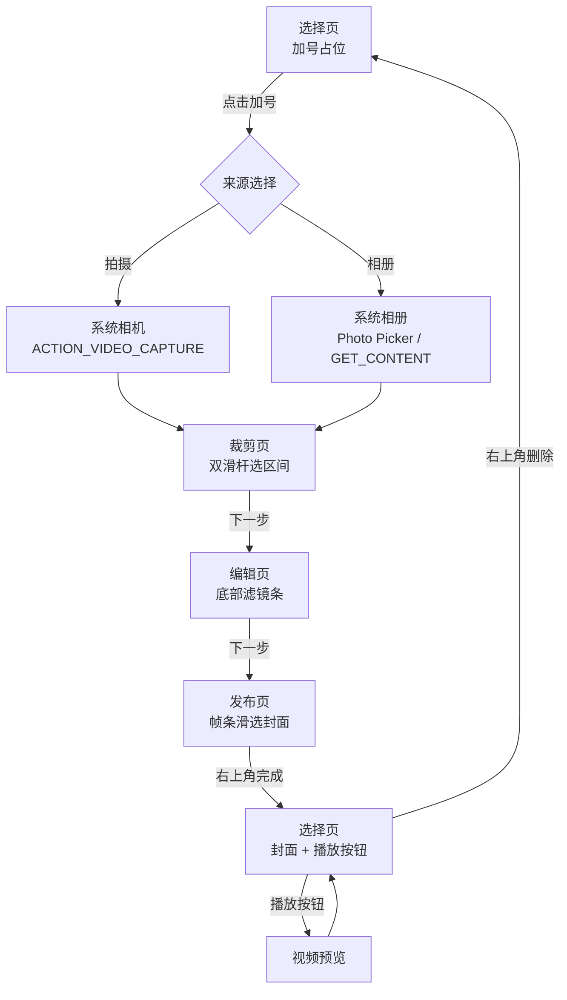

# 视频剪辑 Demo 模块 · 可行性分析与实施计划书

| 项 | 内容 |
| --- | --- |
| 项目 | KtMain（Android 多主题实验工程） |
| 模块代号 | `videoedit` |
| 建议包名 | `com.cy.ktmain.videoedit` |
| 文档状态 | 规划 / 未开发 |
| 结论 | **可以实现**，建议按「Demo 交互闭环」范围落地 |

---

## 1. 结论摘要

**能实现。** 所需能力均落在 Android 系统 API 与常见媒体库能力范围内，不依赖不可行的黑科技。

按 Demo 目标（完整交互闭环、可演示）可在约 **3～5 人日**内完成；若要求「真裁剪导出 + 滤镜成片」，则另加 **3～5 人日**，且工程复杂度明显上升。本计划默认采用 **交互完整、导出可选** 的 Demo 策略。

---

## 2. 目标与非目标

### 2.1 目标（Demo 必须覆盖）

1. 选择页展示【加号】占位图，点击后可 **拍摄视频** 或 **从相册选择视频**。
2. 选中视频后进入 **裁剪页**，用户用进度条/双滑杆圈定需要的区间。
3. 裁剪完成后进入 **编辑页**，底部提供 **滤镜** 切换，预览区实时生效。
4. 下一步进入 **发布页**：底部横向帧条预览每一帧，左右滑动 **选择封面**。
5. 右上角 **完成** 后回到选择页，卡片展示 **封面 + 播放按钮**。
6. 卡片支持右上角 **删除**，点击 **播放按钮** 可预览视频。

### 2.2 非目标（本期不做）

| 非目标 | 说明 |
| --- | --- |
| 多段拼接 / 转场 / 贴纸 / 文字 | 超出 Demo 范围 |
| 真导出 mp4 成片（默认） | Demo 以区间参数 + 预览滤镜模拟即可 |
| 上传 / 发布到服务端 | 「发布页」仅作封面确认页 |
| 复杂音轨编辑 | 静音或跟随原声播放即可 |
| 多选多视频 | 单视频闭环 |

---

## 3. 用户流程



### 页面职责

| 页面 | 职责 | 关键交互 |
| --- | --- | --- |
| **选择页** | 作品入口与结果回显 | 加号；完成后的卡片：封面、播放、删除 |
| **裁剪页** | 圈定可用时间段 | 预览 + 双端滑杆 + 片段时间文案 + 下一步 |
| **编辑页** | 选择滤镜 | 预览（滤镜生效）+ 底部滤镜横向列表 + 下一步 |
| **发布页** | 确定封面 | 大预览 + 底部帧条左右滑动对齐中线选封面 + 右上角完成 |

---

## 4. 可行性分析

### 4.1 能力对照

| 需求 | Android 实现路径 | 可行性 | 备注 |
| --- | --- | --- | --- |
| 拍摄视频 | `Intent(MediaStore.ACTION_VIDEO_CAPTURE)` | ✅ 高 | Demo 优先系统相机；CameraX 可作增强 |
| 选择视频 | Photo Picker（33+）/ `ACTION_GET_CONTENT` / `OpenDocument` | ✅ 高 | minSdk 24 需分支处理 |
| 裁剪「进度」 | 自定义 RangeSeekBar + `MediaPlayer.seekTo` | ✅ 高 | Demo 只存区间参数即可 |
| 真裁剪导出 | Media3 `Transformer` / `MediaMuxer` | ⚠️ 中 | 可选；编解码兼容成本高 |
| 滤镜预览 | `ColorMatrixColorFilter` / RenderEffect / OpenGL | ✅ 高 | Demo 推荐 ColorMatrix，成本最低 |
| 滤镜成片 | Transformer + Effects | ⚠️ 中 | 可选；与真裁剪一起考虑 |
| 帧条抽帧 | `MediaMetadataRetriever.getFrameAtTime` | ✅ 高 | 长视频需降采样、异步加载 |
| 滑动选封面 | 横向 RecyclerView / ScrollView + 中线指示 | ✅ 高 | 项目已有 Carousel/Picker 经验可复用 |
| 播放预览 | `VideoView` / `MediaPlayer` + Surface | ✅ 高 | 也可复用编辑页播放器 |
| 封面回传卡片 | `Bitmap` 缓存文件 + `Uri` | ✅ 高 | 注意 `ActivityResult` 与内存 |
| 删除 | 删缓存文件 + 占位图复位 | ✅ 高 | 简单 |

### 4.2 技术风险与对策

| 风险 | 影响 | 对策 |
| --- | --- | --- |
| 系统相册/相机返回 Uri 无法长期读取 | 预览/抽帧失败 | 尽快拷贝到 `cacheDir` / `filesDir` 私有目录 |
| 超长视频抽帧卡顿/ANR | 帧条不流畅 | 后台线程 + 固定采样数（如 12～20 帧）+ 缩略图尺寸 |
| 部分机型视频旋转元数据 | 预览方向错误 | `MediaMetadataRetriever` 读 `METADATA_KEY_VIDEO_ROTATION`，播放层修正 |
| 滤镜与播放叠加性能 | 低端机掉帧 | Demo 用 ColorMatrix 画在预览层，不做逐像素 GL |
| 真裁剪导出失败率 | 用户「裁了但导不出」 | Demo 默认不导出；导出作为 P2 开关能力 |
| Android 13+ 权限模型 | 选不到视频 | 优先 Photo Picker；存储权限按需最小化 |
| 进程被杀/返回栈 | 中途状态丢失 | `ActivityResult` + 临时文件路径写入 `SavedState` |

### 4.3 与现有工程的契合度

- 项目已有 **HomeActivity 模块卡片** 体系，新增「视频剪辑」入口即可挂载，改动面小。
- 已有 Material3、View + Compose 混用能力；媒体预览界面建议 **View 体系**（SurfaceView/VideoView + 帧条 RecyclerView）更稳妥。
- `minSdk 24 / targetSdk 36`：Photo Picker 需兼容分支，相机用系统 Intent 即可覆盖。
- 工程当前 **无媒体相关依赖**，计划中补充轻量依赖（可选 Media3）。

---

## 5. 推荐技术方案

### 5.1 架构（单 Activity 多页面）

```
VideoEditActivity (宿主，负责页面栈与结果)
 ├─ SelectVideoFragment   // 选择页：加号 / 封面卡片 / 删除 / 播放
 ├─ TrimVideoFragment     // 裁剪页：预览 + RangeBar
 ├─ FilterEditFragment    // 编辑页：预览 + 滤镜条
 └─ CoverPublishFragment  // 发布页：预览 + 帧条选封面
```

也可用 4 个 Activity + Intent 传参；Demo 更推荐 **单 Activity + Fragment**，便于共享播放器与返回拦截。

### 5.2 核心数据模型

```kotlin
data class VideoDraft(
    val sourceUri: Uri,          // 原始（或已拷贝）视频
    val localCopyPath: String,   // 私有目录副本
    val trimStartMs: Long,
    val trimEndMs: Long,
    val filterId: String,        // e.g. NONE / WARM / COOL / GRAY
    val coverTimeMs: Long,       // 选中的封面帧时间
    val coverPath: String?,      // 封面图文件
    val durationMs: Long
)
```

页面间只传 `VideoDraft`（或其路径 + 起止时间），避免传大 Bitmap。

### 5.3 模块内技术选型

| 能力 | 首选 | 理由 |
| --- | --- | --- |
| 拍摄 | `ACTION_VIDEO_CAPTURE` | 零权限复杂度，Demo 足够 |
| 选片 | `ActivityResultContracts.GetContent` + 33+ Photo Picker | 兼容面广 |
| 播放/预览 | `MediaPlayer` + `SurfaceView`（或 `VideoView`） | 可 seek、可滤镜叠加 |
| 裁剪 UI | 自定义 `RangeSeekBar`（或双 `Slider`） | 精确控两端 |
| 滤镜 | `ColorMatrixColorFilter`（5 组预设） | 实现快、性能够 |
| 抽帧 | `MediaMetadataRetriever` | 系统自带 |
| 帧条 | `LinearLayoutManager(HORIZONTAL)` + 等分抽帧 | 与项目 RV 经验一致 |
| 封面选择 | 帧条滚动停在中线 / 或点选 | 按需求「左右滑动选择」 |
| 封面落盘 | `Bitmap.compress(PNG/JPEG)` → `cacheDir` | 回传卡片使用 |
| 真导出（P2） | AndroidX Media3 Transformer | 官方维护，替代过时 MediaConverter |

### 5.4 Demo 策略（重要）

默认 **不重编码视频文件**：

1. 裁剪页记录 `trimStartMs / trimEndMs`，预览在区间内循环播放。
2. 编辑页滤镜只作用于 **预览层**，不写入文件。
3. 发布页按 `coverTimeMs` 抽一帧作为封面。
4. 选择页卡片：`封面 ImageView + 中央播放按钮 + 右上删除`；点播放打开预览，预览按「裁剪区间 + 滤镜预览」播放。

这样完整还原交互，又把编解码风险隔离到 P2。

若产品要求「完成后的视频就是裁剪+滤镜后的成片」，再启用 Media3 Transformer 导出到 `Movies/` 或私有目录。

---

## 6. 页面交互规格

### 6.1 选择页（Select）

| 元素 | 行为 |
| --- | --- |
| 加号占位图 | 点击弹出来源选择：拍摄视频 / 从相册选择 |
| 空状态 | 仅显示加号 |
| 有作品 | 卡片 = 封面图 + 半透明播放按钮 + 右上删除 |
| 播放按钮 | 进入预览（或覆盖层播放） |
| 右上删除 | 二次确认后清空草稿与封面缓存，回到加号状态 |

### 6.2 裁剪页（Trim）

| 元素 | 行为 |
| --- | --- |
| 视频预览 | 默认播放全片；拖动滑杆时 seek 到对应端点 |
| 双滑杆 | 左右端点分别对应起止时间，最小片段建议 ≥ 1s |
| 时间文案 | 显示 `起始 - 结束 / 总长` |
| 下一步 | 写入 `trimStartMs/trimEndMs`，进入编辑页 |
| 返回 | 回选择页，可保留已选视频 |

### 6.3 编辑页（Filter）

| 元素 | 行为 |
| --- | --- |
| 视频预览 | 循环播放裁剪区间；套用当前滤镜 |
| 滤镜条 | 横向列表：原图 / 鲜艳 / 冷调 / 暖调 / 黑白 等 |
| 点选滤镜 | 立即切换预览 ColorMatrix |
| 下一步 | 记录 `filterId`，进入发布页 |

### 6.4 发布页（Cover）

| 元素 | 行为 |
| --- | --- |
| 大预览 | 显示当前封面帧（可静态图，或对应时刻视频画面） |
| 底部帧条 | 均匀抽 N 帧（建议 12～20）横向排列 |
| 中线指示 | 帧条左右滑动，停在中央的帧为封面；`onScrollStateChanged` 取帧 |
| 右上「完成」 | 落盘封面 → 回传选择页并刷新卡片 |
| 返回 | 回编辑页 |

---

## 7. 工程改动清单（接入 KtMain）

```
app/src/main/java/com/cy/ktmain/videoedit/
  VideoEditActivity.kt
  SelectVideoFragment.kt
  TrimVideoFragment.kt
  FilterEditFragment.kt
  CoverPublishFragment.kt
  model/VideoDraft.kt
  model/VideoFilters.kt
  media/VideoCopyHelper.kt      // 拷贝到私有目录、读旋转角
  media/FrameExtractor.kt       // 异步抽帧
  widget/RangeSeekBar.kt
  widget/FrameStripView.kt      // 或直接用 RecyclerView

app/src/main/res/layout/
  activity_video_edit.xml
  fragment_select_video.xml
  fragment_trim_video.xml
  fragment_filter_edit.xml
  fragment_cover_publish.xml
  item_filter.xml
  item_frame_thumb.xml

app/src/main/res/drawable/
  ic_add_video.xml
  ic_play_circle.xml
  ic_delete.xml
  bg_video_card.xml
```

**其它改动：**

- `AndroidManifest.xml`：注册 `VideoEditActivity`；如需相机权限/特征声明按实际路径补充。
- `HomeActivity.kt`：`modules` 增加 `LabModule(..., destination = VideoEditActivity::class.java)`。
- `strings.xml`：模块标题、描述、badge、页面文案。
- `colors.xml` / `themes.xml`：视频页深色预览底（与现有 Lab 风格协调）。
- 可选依赖：`androidx.media3:media3-transformer`（仅 P2 真导出需要）。

---

## 8. 权限与兼容

| 场景 | 方案 |
| --- | --- |
| 选相册视频 | 优先 Photo Picker / `GetContent("video/*")`，通常无需存储权限 |
| 拍摄 | `ACTION_VIDEO_CAPTURE`，由系统相机 App 处理权限 |
| 读私有副本 | 拷贝后不再依赖原始 Uri 权限 |
| 导出成片（P2） | `MediaStore.Video` 写入；API 29+ 用 `IS_PENDING` |

**设备兼容范围：** minSdk 24～target 36 全覆盖；真导出在 24～28 需额外写外部存储权限分支。

---

## 9. 里程碑与工作量

| 阶段 | 内容 | 预估 |
| --- | --- | --- |
| **M0 骨架** | 模块入口、4 页导航、`VideoDraft` 传递 | 0.5 天 |
| **M1 选片** | 加号、拍摄/相册、私有目录拷贝、空/满状态 | 0.5 天 |
| **M2 裁剪** | 预览播放、RangeSeekBar、区间循环、下一步 | 1 天 |
| **M3 滤镜** | 5 组 ColorMatrix 预设、切换预览 | 0.5 天 |
| **M4 封面** | 抽帧、帧条滑动选封面、完成落盘回传 | 1 天 |
| **M5 闭环** | 选择页卡片、播放预览、删除、异常与返回栈 | 0.5 天 |
| **M6 联调** | 真机/模拟器走通全流程、边界视频（竖屏、长视频） | 0.5 天 |
| **小计（Demo）** | | **约 4.5 人日** |
| **P2 真导出** | Media3 裁剪+滤镜导出 | +3～5 人日（可选） |

---

## 10. 验收清单（Demo）

- [ ] 选择页仅见加号时，点击可出现「拍摄 / 相册」入口。
- [ ] 拍摄或选片成功后进入裁剪页，预览可播、双端可拖。
- [ ] 下一步进入编辑页，切换滤镜预览即时变化。
- [ ] 下一步进入发布页，底部帧条可左右滑动，中线对应封面。
- [ ] 右上角完成后回到选择页，卡片显示封面 + 播放按钮。
- [ ] 点击播放可预览视频（按裁剪区间）。
- [ ] 右上角删除可清空并恢复加号态。
- [ ] 竖屏视频方向正确；拒绝授权/取消选择有可理解提示。
- [ ] 主线程无抽帧/拷贝卡顿（长视频抽固定帧数）。

---

## 11. 后续可扩展（不在本期）

1. 真裁剪 + 滤镜导出 mp4（Media3 Transformer）。
2. CameraX 自定义拍摄页（美颜、时长限制）。
3. 多滤镜参数微调（亮度/对比度 Slider）。
4. 多作品列表与草稿恢复。
5. 分享到系统 `ACTION_SEND`。

---

## 12. 决策建议（请确认后进入开发）

| 决策点 | 推荐 | 备选 |
| --- | --- | --- |
| 裁剪/滤镜是否写入成片 | **否，仅预览模拟** | 是，Media3 真导出（工期 +） |
| 页面载体 | **单 Activity + 4 Fragment** | 4 个 Activity |
| 播放器 | **MediaPlayer + SurfaceView** | ExoPlayer/Media3 Player |
| 滤镜 | **ColorMatrix 预设 5 组** | OpenGL 自定义 Shader |
| 入口形态 | **HomeActivity 模块卡片** | 独立入口图标 |

---

*文档版本：v1.0 · 对应仓库：KtMain · 状态：待评审，未编码*
